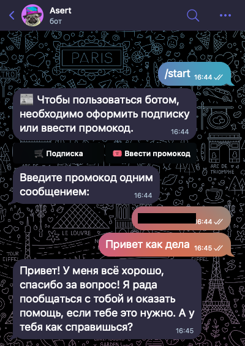

# 🤖 Telegram AI Assistant на базе LLaMA 3.3

Интеллектуальный Telegram-бот на Python с подпиской через TON и интеграцией нейросети **LLaMA 3.3 70B Instruct**.  
Бот умеет отвечать на сообщения пользователя, используя ИИ, и предоставляет доступ только подписчикам или по промокоду.

---

## 🚀 Возможности

- 🧠 **Генерация ответов с помощью LLaMA 3.3**  
  Реальные диалоги с AI через модель `meta-llama/Llama-3.3-70B-Instruct`

- 💬 **Общение через Telegram**  
  Бот отвечает на текстовые сообщения, форматирует ответы и поддерживает диалог

- 🔐 **Система доступа**  
  - Подписка через TON (интеграция с Heleket)
  - Проверка оплаты
  - Промокоды

- 🗄 **Лёгкая база данных**  
  SQLite (`aiosqlite`) для хранения пользователей и подписок

- ⚙️ **Современный Python-стек**  
  Использует `aiogram`, `asyncio`, `aiohttp` и другие асинхронные технологии

---

##  Стек технологий

| Компонент      | Используется                         |
|----------------|--------------------------------------|
| Язык           | Python 3.10+                         |
| Бот            | [aiogram](https://github.com/aiogram/aiogram) |
| Нейросеть      | LLaMA 3.3 (через API)                |
| Платежи        | Heleket API (TON)                    |
| База данных    | SQLite + aiosqlite                   |
| HTTP-запросы   | requests, aiohttp                    |

---

##  Пример работы

  

---

## Портфолио

🔗 [Открыть Telegram-бота](https://t.me/AsetTronuBot)

🔗 ([Портфолио](https://trofim.vercel.app))
